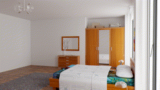
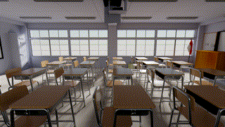
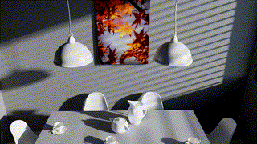
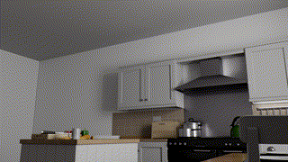

## Tungsten Flythrough Path

The Tungsten Flythrough Path files are coupled with [Tungsten Rendering Engine](https://github.com/tunabrain/tungsten) to render the specific scenes with flythrough path.
The rendering JSON files were originally from Tungsten [Rendering Resources](https://benedikt-bitterli.me/resources/).

Example [Bedroom](https://github.com/xmeng525/TungstenFlythrough/tree/main/bedroom)



Example [Classroom](https://github.com/xmeng525/TungstenFlythrough/tree/main/classroom)



Example [Dining-room](https://github.com/xmeng525/TungstenFlythrough/tree/main/dining-room)



Example [Kitchen](https://github.com/xmeng525/TungstenFlythrough/tree/main/kitchen)



Example [Living-room-2](https://github.com/xmeng525/TungstenFlythrough/tree/main/living-room-2)


By using the flythrough path files, you agree to cite the following references.
```
@misc{resources16,
   Author = {Benedikt Bitterli},
   Year = {2016},
   Note = {https://benedikt-bitterli.me/resources/},
   Title = {Rendering resources}
}
@inproceedings {.20201133,
    booktitle = {Eurographics Symposium on Rendering - DL-only Track},
    editor = {Dachsbacher, Carsten and Pharr, Matt},
    title = {{Real-time Monte Carlo Denoising with the Neural Bilateral Grid}},
    author = {Meng, Xiaoxu and Zheng, Quan and Varshney, Amitabh and Singh, Gurprit and Zwicker, Matthias},
    year = {2020},
    publisher = {The Eurographics Association},
    ISSN = {1727-3463},
    ISBN = {978-3-03868-117-5},
    DOI = {10.2312/sr.20201133}
  }

```
